  

<em>
  dev em formação · helpdesk @ <a href="https://icl.com.br">ICL</a> · 📍 São Paulo, BR 🇧🇷
</em>

---

<!--
<h3>🛠 Stack & Ferramentas</h3>

   
   
  

> Tecnologias que venho aprendendo e aplicando em projetos pessoais, acadêmicos e cursos.

---
-->

<h3>📈 GitHub</h3>

  
  

---

<h3>👾 Contribuições</h3>

<!-- 🎮 Jogo do dia — sorteado a cada rodada do workflow (.github/workflows/snake.yml).
     Rodízio: pacman, breakout, galaga, puzzle-bobble, bomberman, minesweeper e a cobrinha.
     O job publica o SVG escolhido em today[-dark].svg (branch output), então esta seção
     nunca precisa mudar: o jogo troca sozinho. -->
<picture>
  <source media="(prefers-color-scheme: dark)" srcset="https://raw.githubusercontent.com/flippelt/flippelt/output/today-dark.svg" />
  <source media="(prefers-color-scheme: light)" srcset="https://raw.githubusercontent.com/flippelt/flippelt/output/today.svg" />
  
</picture>

---

<h3>📫 Vamos conversar?</h3>

  
  
  

